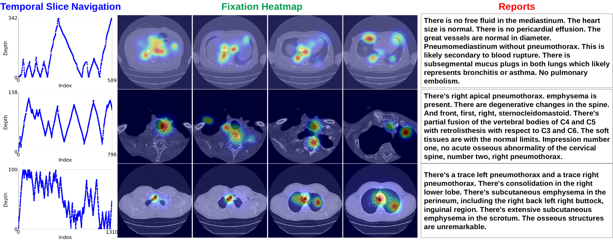
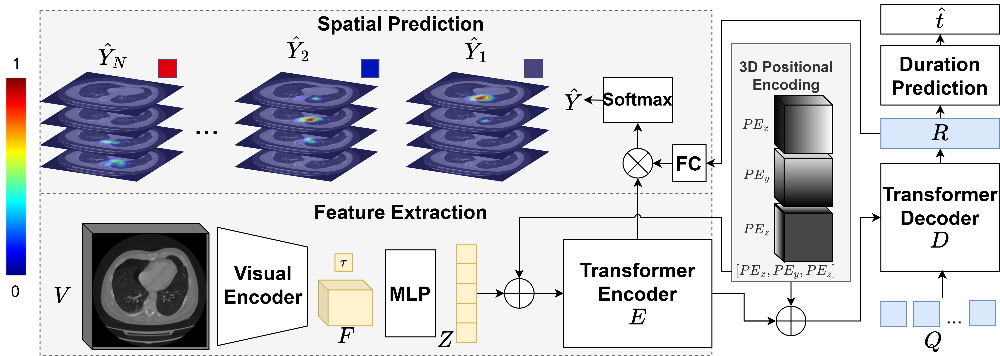

# CT-ScanGaze: A Dataset and Baselines for 3D Volumetric Scanpath Modeling

<div align="center">

[](https://iccv2025.thecvf.com/)
[](https://arxiv.org/html/2507.12591v1)
[](https://huggingface.co/datasets/phamtrongthang/CT-ScanGaze)
[](https://creativecommons.org/licenses/by-sa/4.0/)

</div>

This repository provides the first publicly available dataset of expert radiologist gaze during CT analysis **CTScanGaze** and **CT-Searcher**, a transformer-based model for 3D scanpath prediction on medical CT volumes. Our work addresses the critical gap in understanding how radiologists visually examine 3D medical images during diagnostic procedures.

<div align="center">
  
  <br>
  <em><strong>Figure 1:</strong> CTScanGaze</em>
</div>

<div align="center">
  
  <br>
  <em><strong>Figure 2:</strong> CTSearcher</em>
</div>

**🎉 This work has been accepted as a highlight paper at ICCV 2025! 🎉**

## 📋 Table of Contents

- [Installation](#installation)
- [Dataset](#dataset)
- [Training](#training)
- [Evaluation](#evaluation)
- [Citation](#citation)
- [Contact](#contact)

## 🛠️ Installation

### Quick Setup

```bash
# Clone the repository
git clone https://github.com/UARK-AICV/CTScanGaze
cd CTScanGaze

# Create conda environment
conda create -n ctsearcher python=3.9
conda activate ctsearcher

pip install uv 

uv pip install -r requirements.txt
```


## 📊 CT-ScanGaze Dataset

**CT-ScanGaze** is the first publicly available eye gaze dataset focused on CT scan analysis. The dataset is available on [Hugging Face](https://huggingface.co/datasets/phamtrongthang/CT-ScanGaze).


Each data sample contains the following fields:

```python
{
    "name": str,           # CT scan identifier
    "subject": int,        # Radiologist ID
    "task": str,           # Task description
    "X": list,             # X coordinates of fixations
    "Y": list,             # Y coordinates of fixations  
    "Z": list,             # Z coordinates (slice numbers)
    "T": list,             # Fixation durations in seconds
    "K": int,              # Fixation captured time
    "length": int,         # Scanpath length
    "report": str,         # Report for this CT
}
```
Note that other fields in the JSON are dummy, so you do not need to care about them. For the reports, many reports will look like duplications because multiple CTs are from the same CT reading session for the same patient.

Additionally, we provide zip files containing all CT scans that match the identifiers, along with corresponding radiological reports for each CT scan.


## 🏃‍♂️ Training

### Quick Start
There is another step to prepare the extracted CT feature first before running the scripts below. I will update this later (⚠️TODO). But for anyone wants to go ahead, we use SwinUNETR. 

```bash
# Train the gaze predictor using the synthetic data
bash bash/train_semi.sh

# Train the gaze predictor on CTScanGaze.
bash bash/train_no_semi.sh
```

### Custom Training

```bash
python src/train.py \
    --img_dir /path/to/ct/images \
    --feat_dir /path/to/swin_features \
    --fix_dir /path/to/gaze/data \
    --log_root runs/experiment_name \
    --epoch 40 \
    --batch 2
```

## 🔬 Evaluation

### Test a Trained Model

```bash
python src/test.py \
    --resume_dir runs/COCO_Search_baseline \
    --img_dir /path/to/test/ct/images \
    --feat_dir /path/to/test/features \
    --fix_dir /path/to/test/gaze/data
```

### Evaluation Metrics

We use comprehensive 3D-adapted metrics for scanpath evaluation:

**Scanpath-based Metrics:**
- **ScanMatch (SM)**: Spatial and temporal similarity with duration consideration
- **MultiMatch (MM)**: Five-dimensional assessment (shape, direction, length, position, duration)
- **String Edit Distance (SED)**: Sequence-based comparison using Levenshtein distance

**Spatial-based Metrics:**
- **Correlation Coefficient (CC)**: Linear correlation between predicted and ground truth heatmaps
- **Normalized Scanpath Saliency (NSS)**: Normalized saliency at fixation locations
- **Kullback-Leibler Divergence (KLDiv)**: Distribution similarity measure

## ⚠️ TODO

The current code base is working as long as the path and extracted features are prepared. But a lot of refactoring work is needed. 

- [ ] Extracted feature of CTs
- [ ] Clean and refactor codebase
- [ ] Synthetic dataset
- [ ] Improve code comments and structure


## 📜 Citation

If you find our work useful, please cite our paper:

```bibtex
@article{pham2025ct,
  title={CT-ScanGaze: A Dataset and Baselines for 3D Volumetric Scanpath Modeling},
  author={Pham, Trong-Thang and Awasthi, Akash and Khan, Saba and Marti, Esteban Duran and Nguyen, Tien-Phat and Vo, Khoa and Tran, Minh and Nguyen, Ngoc Son and Van, Cuong Tran and Ikebe, Yuki and others},
  journal={arXiv preprint arXiv:2507.12591},
  year={2025}
}
```

## � Acknowledgments

This material is based upon work supported by the National Science Foundation (NSF) under Award No OIA-1946391, NSF 2223793 EFRI BRAID, National Institutes of Health (NIH) 1R01CA277739-01.

## �📄 License

This project is licensed under the Creative Commons Attribution Non Commercial Share Alike 4.0 International License. See the [LICENSE](LICENSE) file for details.


## � Contact

**Primary Contact**: Trong Thang Pham (tp030@uark.edu)

For questions, feedback, or collaboration opportunities, feel free to reach out! I would love to hear from you if you have any thoughts or suggestions about this work.

**Note**: While we don't actively seek contributions to the codebase, we greatly appreciate and welcome feedback, discussions, and suggestions for improvements.


---

<div align="center">

**⭐ Star this repository if you find it useful! ⭐**

</div>
